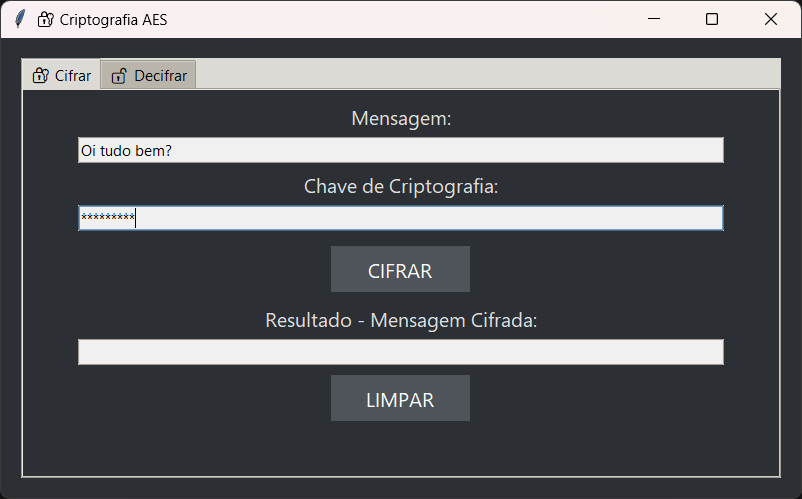
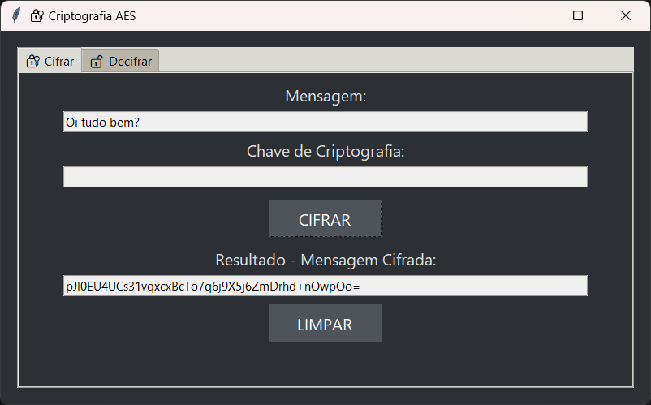
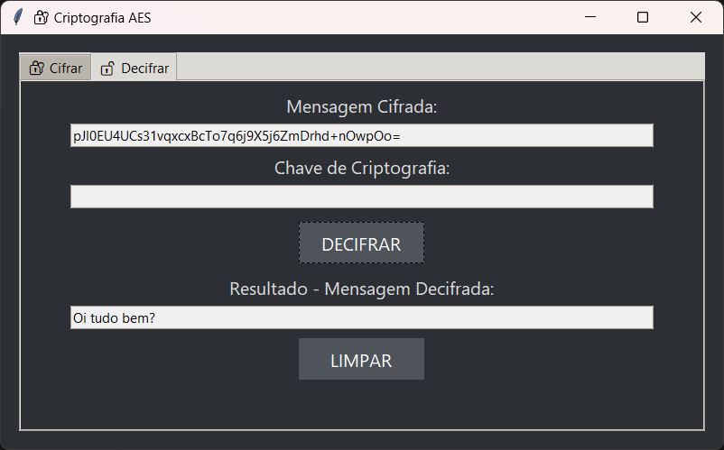

# 🔐 Projeto de Criptografia AES com Interface Gráfica em Python

Este projeto apresenta a implementação de um sistema de **criptografia simétrica por blocos** utilizando o algoritmo **AES (Advanced Encryption Standard)**. O sistema conta com uma interface gráfica moderna que permite ao usuário **cifrar e decifrar mensagens** com base em uma chave secreta definida manualmente.

---

## 📌 Objetivos da Prova

- Implementar criptografia simétrica por blocos (AES, DES ou 3DES)
- Criar funções para **cifrar e decifrar mensagens de texto**
- Utilizar **chave definida pelo usuário**
- Disponibilizar o código com documentação e imagens da execução

---

## ⚙️ Execução do Projeto

### ✅ Requisitos

- Python 3.10 ou superior
- Biblioteca `pycryptodome`

### 📦 Instale com:

```bash
pip install pycryptodome
```

### ▶️ Execute com:

```bash
python interface.py
```

---

## 🧠 Sobre o Algoritmo AES

O **AES (Advanced Encryption Standard)** é um dos algoritmos de criptografia simétrica mais utilizados atualmente. Ele divide os dados em blocos de 128 bits e utiliza uma chave (neste projeto, definida pelo usuário) para cifrar e decifrar a informação.

Neste projeto utilizamos:
- 🔐 Modo **CBC (Cipher Block Chaining)**
- 🧩 Preenchimento com **PKCS7 padding**
- 🔄 **IV aleatório** gerado a cada cifragem para segurança adicional
- 📥 A chave é digitada pelo usuário e processada com padding automático

---

## 🗂️ Estrutura e Explicação do Código

### `aes_cipher.py`

Contém a classe `AESCipher`, que:
- Recebe a chave do usuário e aplica o padding
- Cifra mensagens com `AES.new(..., CBC, iv)`
- Decifra mensagens convertidas de base64
- Usa o módulo `Crypto.Cipher`, `Crypto.Util.Padding`, `base64`

---

### `interface.py`

Cria a **interface gráfica principal**, que:
- Organiza a tela em duas abas: **Cifrar** e **Decifrar**
- Recebe entrada de mensagem e chave
- Exibe o resultado cifrado ou decifrado
- Inclui botões "CIFRAR", "DECIFRAR" e "LIMPAR"
- Garante janela centralizada e responsiva

---

### `design.py`

Define o **tema visual** do sistema:
- Estilo **dark mode elegante**
- Cores suaves (#2c2f33, #f0f0f0, #dddddd)
- Fontes maiores e legíveis (Segoe UI 12pt)
- Botões modernos com hover visual

---

## 📸 Imagens da Execução (Fluxo Completo)

Abaixo estão as capturas de tela feitas em sequência para demonstrar o funcionamento da aplicação:

### 1. Tela Inicial - Cifrar
O usuário digita a mensagem e a chave.


---

### 2. Resultado da Cifragem
O campo “Resultado” mostra a mensagem criptografada.



---

### 3. Acesso à Aba de Decifrar
O usuário cola a mensagem cifrada e a mesma chave.



---

### 4. Resultado da Decifragem
A mensagem original é recuperada corretamente.


---

### 5. Sistema Completo em Funcionamento
Interface final com todos os elementos visíveis e funcionais.



---

## 📂 Estrutura Final do Projeto

```
prova1_criptografia_aes/
├── aes_cipher.py       # Lógica AES (cifrar e decifrar)
├── design.py           # Estilo visual (dark mode elegante)
├── interface.py        # Interface gráfica com abas e botões
└── imagens/            # Capturas de tela da execução real
```

---

## 🧾 Conclusão

O sistema desenvolvido cumpre todos os requisitos propostos na atividade de prova, utilizando um dos algoritmos de cifra por blocos mais seguros do mundo. Com uma interface gráfica acessível e moderna, é possível cifrar e decifrar mensagens de maneira segura e prática, com separação clara entre lógica, visual e interface.

Este projeto demonstra com clareza o funcionamento da criptografia simétrica AES, reforçando o entendimento prático sobre segurança de dados em aplicações reais.

---
